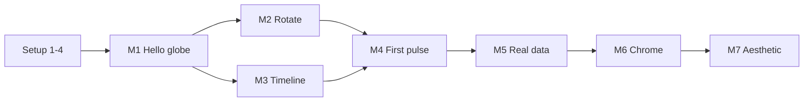

# Stage 5 – Build Plan

Thin-slice ordering that prioritises having a demoable end-to-end loop early, then layering polish.

## Milestones

- **M1 – Hello globe.** Page loads, shows a static globe. _Proof the stack works._
- **M2 – Globe rotates.** Drag to spin. _Proof the render loop works._
- **M3 – Timeline scrubs.** A visible virtual date that the user can drag. _Proof the clock works._
- **M4 – First pulse.** One hard-coded pulse fires at a single country when the clock crosses a date. _Proof of the end-to-end playback loop._
- **M5 – Real data wired.** Pulses driven by the dataset, all countries, evenly distributed. _MVP core loop complete._
- **M6 – Chrome.** Side panels (country list, stats), speed controls, play/pause. _Usable product._
- **M7 – Aesthetic pass.** Fonts, palette, roughen filter, sparkline, footer. _Ship quality._

Each milestone is a commit; commit messages should name the milestone.

## Task list

### Setup
1. Create `index.html` with import map, mount point, link to `styles.css`.
2. Create `styles.css` with CSS custom properties for the palette, body styles.
3. Create `app.js` with a minimal Preact root rendering "hello".
4. Verify it loads cleanly in Chrome and via `python -m http.server`.

### M1 – Hello globe
5. Vendor `data/countries-110m.json` from world-atlas.
6. Add `src/data.js` to `fetch` both JSONs, return a combined object.
7. Add `src/geo.js` exporting a configured `d3-geo` orthographic projection + a `path` generator.
8. Add `src/components/Globe.js`: SVG element sized to a square, renders one path per country, renders a graticule.
9. Wire Globe into `app.js`; data loaded once at startup.

### M2 – Globe rotates
10. Add pointer-drag handler on the Globe SVG that updates `projection.rotate([…])` and forces a re-render.
11. Throttle rotation updates via `requestAnimationFrame` coalescing (one update per frame).

### M3 – Timeline scrubs
12. Create `src/state.js` with signals: `virtualDate`, `playing`, `speed`, `visibleCountries`, `focusCountry`.
13. Add `src/components/Timeline.js`: horizontal SVG with year ticks, a playhead bound to `virtualDate`, drag-to-scrub, click-to-jump.
14. Keyboard handlers: `←/→` step one month; `Shift+arrow` step one year; `Space` toggles `playing`.
15. Add `src/playback.js` with a `requestAnimationFrame` loop that advances `virtualDate` when `playing` is true, multiplied by `speed` (virtual-days-per-real-second).

### M4 – First pulse
16. Add `src/components/LaunchLayer.js`: an SVG `<g>` that holds active pulse elements.
17. Emit a single hard-coded pulse when `virtualDate` crosses 1969-07-16 (Apollo 11 launch) at the US centroid. Style with a CSS keyframe animation, remove on `animationend`.
18. Verify pulse appears on scrub both forward and backward.

### M5 – Real data wired
19. In `src/playback.js`, pre-compute the flat sorted `events[]` array at load time from the launches JSON, using even intra-year distribution + deterministic jitter keyed on `countryCode + year`.
20. Maintain a cursor index; on each tick, emit any events whose `t` is within `(prevDate, virtualDate]`. On scrub, re-seek via binary search.
21. Project each emitted event's centroid to SVG coords at pulse time. Hide pulses on the globe's far side using `geoDistance > π/2`.
22. Cap concurrent pulses (e.g. 60 — drop oldest).
23. Smoke-test at 10x speed across 2023–2025 (the densest stretch). Should feel right, not strobe-y.

### M6 – Chrome
24. Add `src/components/CountryList.js`: ranked rows with visibility checkboxes, running totals to `virtualDate`, click-to-focus. Rows re-order on rank changes with a CSS transition.
25. Add `src/components/Stats.js`: total launches, current-year count, average rate derived as "1 every X days".
26. Add play/pause button and speed chips (1x / 2x / 5x / 10x) in the Timeline component.
27. Implement the partial-year logic for 2026 so current-year stats don't project forward.

### M7 – Aesthetic pass
28. Import the two web fonts in `index.html` (`<link rel="preload">`).
29. Add the `feTurbulence + feDisplacementMap` "roughen" SVG filter; apply to country paths.
30. Style the timeline with drawn-style strokes (`stroke-dasharray` variation).
31. Add the per-country sparkline above the timeline.
32. Add the footer with data attribution.
33. Add the rocket glyph and "GLOBAL ROCKET LAUNCH TRACKER" title in the header.
34. (Optional, if time) "LATEST LAUNCH" dropdown showing the last 3 pulses.

## Task dependency graph

## Checkpoints during build

Stop and sanity-check at each milestone:

- Does it open at `file://` AND at `http://localhost:8000`?
- Any console warnings?
- Frame rate still okay under load?
- Anything drifting from the design brief?

## If we run out of weekend

Cut order (from first to cut):

1. Sparkline above the timeline.
2. Latest-launches dropdown.
3. Roughen SVG filter (use plain strokes).
4. Row re-order animation.
5. Keyboard controls beyond Space + arrows.

Do **not** cut: globe, timeline scrub, at least 3 countries of launches, play/pause, one speed change.

## Review

Approve to begin Stage 6 (implementation). This is the last cheap-to-change stage.
